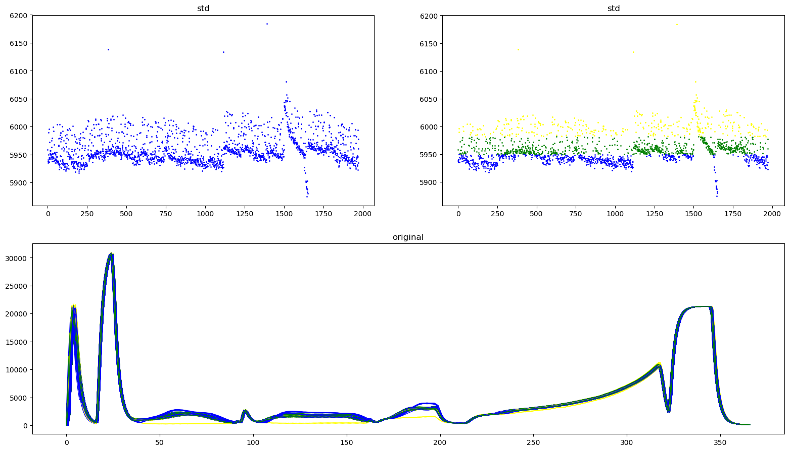
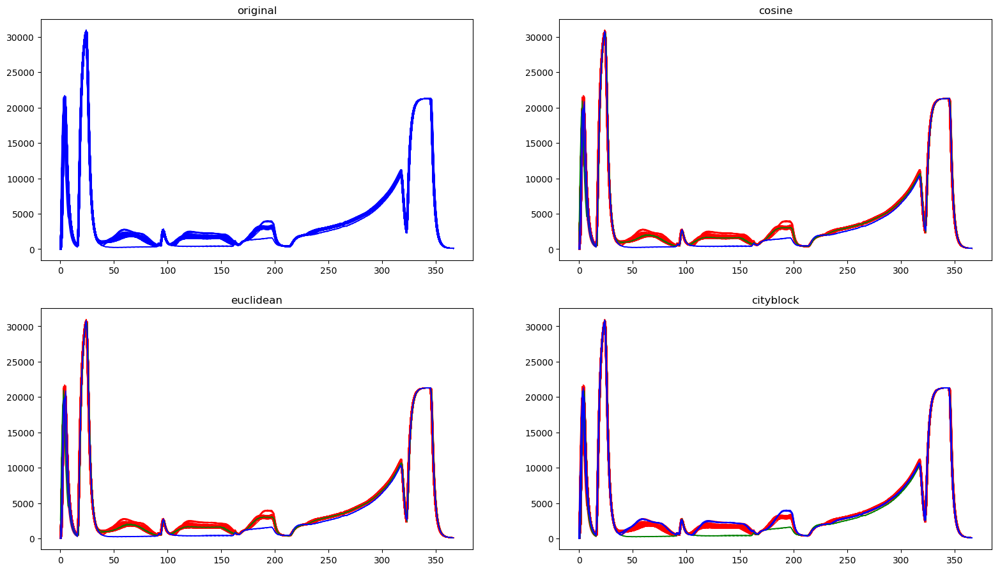
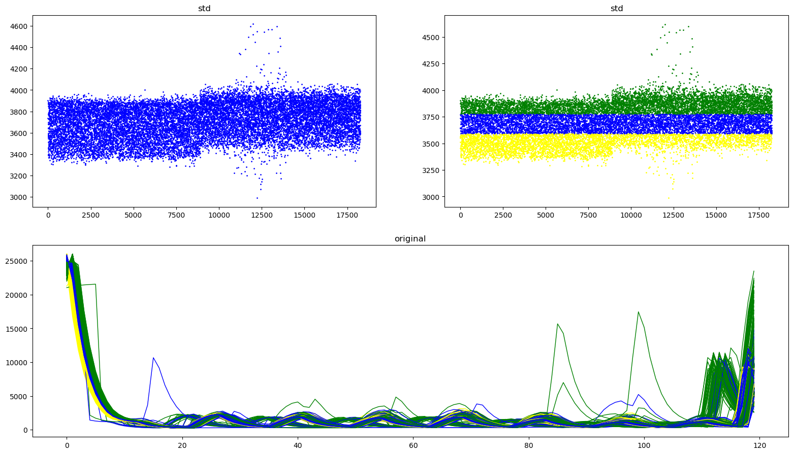
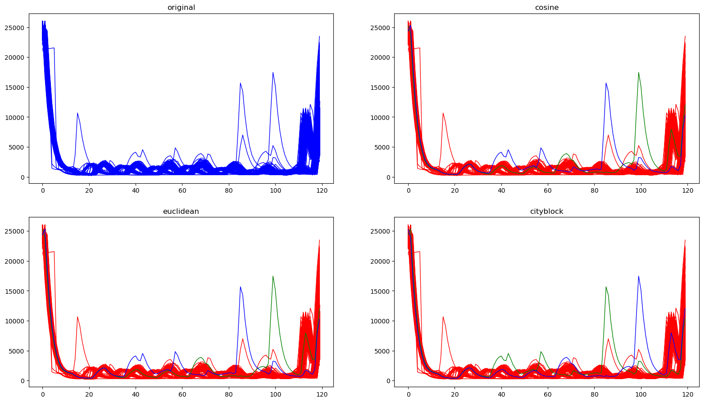

## 데이터 분석 ##

### 개요 ###
- 특정 row 데이터(파형) 에 대한 여러가지 분석기법을 사용해봅니다.

### 매인 파일 ###
- main.py

### 사용할 언어 및 프레임워크 ###
- python 3.6.4
- matplotlib
- sklearn
- tensorflow

### 0716. 현재 진행사항 ###
1. python3 main.py dataName original : 오리지날 데이터(평균, 분산, 표준편차) 그래프 
2. python3 main.py dataName kmeans : K-means 클러스터링
3. python3 main.py dataName hierarchical : Hierarchical-agglomerative 클러스터링
4. python3 main.py dataName autoEncoder : 비지도학습 auto-encoder
5. python3 main.py dataName GAN : 비지도학습 Generative Adversarial Networks

### 향후 계획 ###
- 파형의 파손데이터를 생성하여 레이블링후 지도학습 (CNN 이나 RNN)을 적용해 classification 해봄

